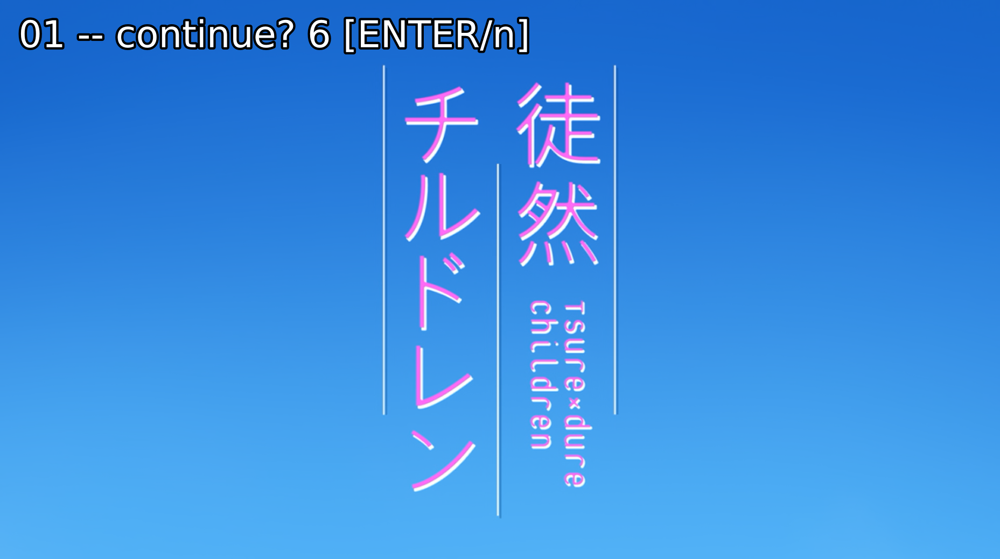

# mpv-scripts

These are scripts written for mpv.

## How to use

- Windows: move `.lua` files into `<path of mpv>/scripts/`
- Linux: move `*.lua` files into `~/.config/mpv/scripts/`

## show_filename.lua

A simple script to show the name of current playing file.  To use this function, you need to press `SHIFT+ENTER`.

Besides, for better experience, you could adjust the `osd-font-size` property in mpv.conf  

For example:

``` txt
osd-font-size=30
```

## history-bookmark.lua

It is originally coded by my friend [sorayuki](https://github.com/sorayuki-winter/mpv-plugin-bookmark). Since I believe using mpv.conf is more convenient and safer. I removed the function which will save positions all the time during playing time.

This script helps you to create a history file `.mpv.history` in the video folder. The next time you want to continue to watch it, you can open any videos in the folder. The script will lead you to the video played last time.



Like the screenshot, last time we watched episode 1. Now we can press `ENTER` to jump to ep1, press `n` or do nothing to stay in the episode we are watching now.

In order to resume from the exact point of the watching progress in target episode, you just need to add a line in the mpv.conf

``` txt
save-position-on-quit
```

## Other scripts I recommend

[autoload](https://github.com/mpv-player/mpv/blob/master/TOOLS/lua/autoload.lua): Automatically load playlist entries before and after the currently playing file, by scanning the directory.

## Contributors

<a href="https://github.com/yuukidach/mpv-scripts/graphs/contributors">
  
</a>
